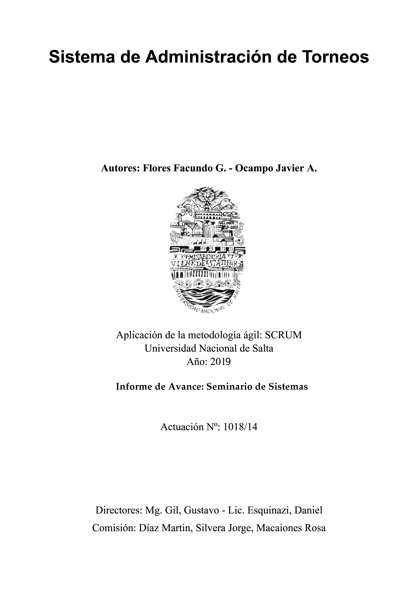
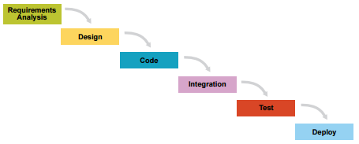
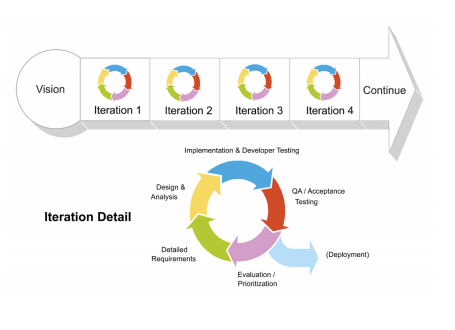
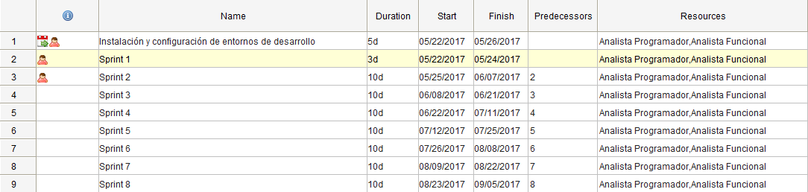
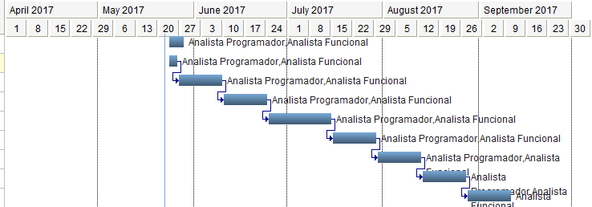

.. contents:: Tabla de contenidos
    :depth: 3

.. sectnum::

.. raw:: PDF

    PageBreak

.. footer::

    ###Page###

Introducción
------------

El presente proyecto titulado *Sistemas de administración de torneos* surge como respuesta
a la necesidad de los organizadores de eventos deportivos, para agilizar la gestión de torneos y equipos. Además la presente propuesta ayudará a la difusión de torneos por redes sociales, inscripción de los equipos

Objetivos
---------

Objetivos generales
###################

* Implementar un servicio utilizando la metodología de desarrollo de software ágil SCRUM.
* Ganar experiencia en la administración y desarrollo de proyectos informáticos.
* Fomentar el aprendizaje de las tecnologías más utilizadas en el mercado actual para enriquecer las habilidades profesionales de cada integrante del equipo.
* Desarrollar un software de calidad.
* Iniciar un emprendimiento local con la posibilidad de expandirnos dentro de la industria del software.

Objetivos Específicos
#####################
* Permitir el acceso a una aplicación disponible sobre plataformas web y mobile.
* Diseñar una interfaz cómoda y accesible para los distintos usuarios.
* Utilizar los métodos de autenticación más populares del mercado, para así abarcar mayor rango de usuarios.
* Facilitar la inscripción y seguimiento de los equipos que participan en los torneos.
* Dejar en disposición la personalización de distintos tipos de sistemas de eliminatorias para cada torneo.
* Permitir la visualiación de información estadística desde distintos dispositivos.
* Posibilitar el cobro de inscripciones de equipos a torneos.

Sistema Objeto
--------------

El sistema consistirá de dos interfaces, de una mobile y otra web. Se permitirá a los usuarios gestionar torneos, equipos y jugadores;
además se contemplará la generación y presentación de estadísticas y reportes. Por otro lado, y no por ello menos importante, se considera
la administración de fixtures. A continuación se describirá las características principales de cada módulo:

Gestión de usuarios
###################

Nuestro sistema incluirá los siguientes tipos (roles) de usuarios:

* Organizador: Posee los más altos privilegios sobre el sistema, pudiendo acceder a todas las secciones con la posibilidad de editar cualquier información. Serán los encargados de gestionar torneos, registrar equipos y jugadores.
* Delegado: Podrá cargar datos pertenecientes al equipo, logo o escudo del mismo y los jugadores.
* Árbitro: Se encargará de introducir el acta completa del partido o evento.

Gestión de torneos
##################

En cuanto a esta sección dispondremos de lo siguiente:

* Fixture automático: Realizará el sorteo de cruces de forma automática.
* Importación a partir de planillas excel: Se podrá importar un fixture activo a nuestra competición, procesando los datos, adjudicando puntos correspondientes a los equipos que jugaron previamente algún partido.
* Administrador de clasificaciones: Realizarán el cálculo y reparto de puntos, permitiendo la edición manual de los resultados.
* Modalidades: Se implementarán diferentes modalidades según la disciplina para la cual se ha creado el torneo.
* Deportes: Soporte para múltiples tipos de deportes o disciplinas.
* Compartir: El torneo podrá ser compartido sobre diferentes redes sociales o a través de un link.
* Perfil público.

Gestión de equipos
##################

* Gestión de altas y bajas: Permitirá la administración de los integrantes del equipos.
* Tipos de equipos: Individual o grupal.
* Perfil público.
* Inscripción: Se presentarán formularios de inscripción para equipos. Se permiten dos modalidades: creación de equipo a través de torneo, o bien crear un equipo y luego ligarlo a un torneo.
* Gestión de pagos: Se incluirán modalidades de pago, por paypal, transferencia bancaria o bien en mano.

Gestión de jugadores
####################
* Alta o baja de jugadores.
* Enlace con el / los equipos.
* Impresión de fichas: los jugadores de cada equipo contarán con fichas personalizadas conteniendo datos y foto de cada uno de ellos.
* Perfil público.

Gestión de partidos
###################

* Cabeceras de actas: Se llenarán automáticamente para poder realizar el arbitraje correspondiente dejándola a disponibilidad de los árbitros en el inicio del partido.
* Estadísticas: Se guardarán y calcularán las correspondientes estadísticas para su futuro muestreo; así como también dejará disponible todos los datos para la generación de reportes.

Gestión de imagen
#################

Administración de la imagen perteneciente al torneo, pudiendo así publicitarla a través de diferentes redes sociales.

Notificaciones
##############

Recepción de notificación a través de distintos usuarios, por ejemplo: horario, fecha, lugar, suspensión, del partido, o bien vencimiento de cuotas.

Fixture
#######

Consulta de resultados de partidos anteriores, así como también consulta de futuros eventos.

Gestión de Equipos
##################

Posibilidad de gestionar equipos, dar de alta o baja jugadores, editando información personal, fotos y archivos adjuntos. Además se podrá visualizar el historial de cada equipo, estadísticas, etc.

Incidencias
###########

Visualización de estadísticas individuales de cada jugador: goles, tarjetas, tiempos, puntos, etc.

Marco Teórico
--------------

Metodologías ágiles
###################

El movimiento ágil busca alternativas al manejo de proyectos tradicional. Los enfoques ágiles ayudan a los equipos a responder a la impredecibilidad a través de un trabajo incremental e iterativo y un feedback empírico, es decir a través de corrección de fallos. Además, se proponen alternativas al desarrollo en cascada y secuencias tradicionales de desarrollo.

¿Por qué elegirlas? Proveen oportunidades para evaluar la dirección de un proyecto a través del desarrollo de su ciclo de vida. Esto se logra a través de un trabajo regular, conocido como iteración, donde al final, cada equipo, deberá presentar un producto potencialmente entregable. A través de repeticiones breves de ciclos de vida, así como tambien de productos funcionales, la metodología ágil se describe como iterativa e incremental. En los desarrollos en cascada, los equipos tienen una única chance de conseguir un aspecto de proyecto correcto, mientras que en el paradigma ágil, cada aspecto de desarrollo, requerimientos, diseño, etc., es contínuamente revisado a través del ciclo de vida. Cuando un equipo se para y re-evalúa la dirección de un proyecto cada dos semanas, siempre hay tiempo para encaminarse en otra dirección [2]_.

Scrum
#####

Es el camino más popular de introducción a la "Agilidad" debido a su simplicidad y flexibilidad. Debido a su popularidad, muchas organizaciones dicen "hacer Scrum" pero no están siquiera cerca a la definición actual de Scrum. Scrum hace énfasis en el feedback empírico, los equipos se autogestionan y esfuerzan para construir productos debidamente probados con pequeñas iteraciones.

Se considera a Scrum un framework para el desarrollo incremental de productos, utilizando equipos interfuncionales y auto-organizados. Provee una estructura de roles, meetings, reglas y artefactos, donde los equipos son los responsables de crear y adaptar sus procesos dentro de este framework.

Por otro lado, Scrum utiliza iteraciones de longitud fija: Sprints. Los Sprints no son mayores a 30 días, preferentemente menores. Los equipos de Scrum tratan de construir un incrementos de producto (apropiadamente probado) por cada Sprint [3]_.

Scrum vs Cascada
****************

El enfoque incremental e iterativo cambia las fases de desarrollo tradicional del modelo cascada por la habilidad de desarrollar un conjunto de características de alto valor incorporando feedback lo más pronto posible.

  Modelo en cascada tradicional.
  Depende de un entendimiento perfecto de los requerimientos del producto para minimizar el número de errores en cada fase.

  Modelo de iteraciones en Scrum.
  Une todas las etapas de desarrollo en cada iteración, adaptandolas al descubrimiento de realidades en intervalos fijos.

Las principales desventajas del modelo en cascada son: la inflexibilidad del proyectos en las distintas etapas del mismo, tener que establecer compromisos con el cliente en una etapa temprana, y se dejan los problemas que surgen en la etapa de desarrollo para más adelante.
El beneficio más grande de Scrum es para trabajos complejos que conlleven creación de conocimiento y colaboración, tales como el desarrollo de un neuvo producto. Generalmente es asociado con el desarrollo de software orientado a objetos [3]_.

Características de un equipo Scrum
**********************************

* Interfuncional: existen miembros de distintas disciplinas: analista de negocios, diseñadores, expertos del dominio, etc.
* Auto-organizado / auto-gestionado.
* Se planea un Sprint a la vez con el Product Owner.
* Posee autonomía de acuerdo a cómo desarrollar cada incremento.
* Intensamente colaborativo.
* Muy exitoso cuando todo el equipo se encuentra en la misma sala, particularmente para los primeros Sprints.
* Muy exitoso a largo plazo cuando existe permanencia de los miembros a largo plazo.
* De 3 a 9 miembros.
* Tiene un rol de liderazgo [3]_.

Roles
#####

Product Owner
*************

Es el responsable de hacer uso del "Product Backlog" para asegurar las características funcionales más valuables son producidas primero; esto se consigue priorizando el Product Backlog para encolar los requerimientos más valiosos para la siguiente iteración.

Equipo
*******

Responsable de desarrollar la funcionalidad. Los equipos generalmente son auto-gestionados, auto-organizados, e interdisciplinarios, y además son responsables de darse cuenta de como tornar el Product Backlog en incrementos de funcionalidad dentro de una iteración y manejar su propio trabajo para llevarlo a cabo.

Los miembros del equipo colectivamente responsables del éxito de cada iteración y del proyecto como un todo.

Scrum Master
************

Es responsable de que el proceso Scrum se lleve a cabo con éxito, de enseñar Scrum a cada persona involucrada en el proyecto, e implementar Scrum de tal modo que encaje dentro de la cultura organizacional asegurando que todos sigan las reglas y prácticas de Scrum [1]_.

Artefactos
##########

Product Backlog
***************

Los requerimientos para el sistema o el producto siendo desarrollados por el proyecto son listados en Product Backlog. El Product Owner es el responsable de los contenidos, priorización y disponibilidad del Product Backlog. Éste último nunca se completa, y es utilizado en el plan del proyecto como una estimación inicial de los requerimientos. El Product Backlog evoluciona con el producto y el entorno en el cual se desarrolla. Es dinámico, manejando constántemente los cambios identificando qué necesidades debe satisfacer el producto. Mientras el producto exista, el Product Backlog también lo hará.

Product Backlog Item
**********************

Describe el qué más que el cómo de un feature centrado en el cliente. Generalmente son escritos como Historias de Usuario, a veces poseyendo un item de criterio de aceptación.

Sprint Backlog
**************

Define el trabajo, o tareas, que el Equipo debe desarrollar durante un Sprint en particular. El equipo compila una lista inicial de estas tareas en la segunda parte del Sprint Planning Meeting. Las tareas deben ser divididas de tal forma que puedan ser finalizadas entre 4 y 16 horas. Las tareas que duran más de 16 horas son consideradas como no apropiadamente bien definidas. Sólo el Equipo puede cambiar el Sprint Backlog, y el mismo debe estar ubicado de una manera altamente visible para todo el equipo. Una vez que la tarea es definida, el número de horas restante estimado para completar la tarea se ubica en la intersección de la tarea y el día del Sprint que la persona está trabajando.

Incremento
**********

Comprende las funcionalidades completadas durante los sprints y liberados cada vez que el Product Owner lo desee. Luego, son inspeccionados durante los Sprint Review Meetings.

Sprint Burndown Chart
*********************

Se caracteriza por mostrar la suma total de trabajo realizado dentro de cada Sprint, el mismo debe ser actualizado diariamente. Su fin, es facilitar la auto-organización. El Scrum Master debería discontinuar su uso, si el mismo se vuelve un impedimento para la auto-organización del equipo.

Product / Release Burndown Chart
********************************

Realiza un "tracking" de las tareas faltantes en el Product Backlog para el siguiente Sprint [1]_.

Estudio de factibilidad
-----------------------

Es un estudio que se hace de los recursos existentes en la organización y en el medio, para determinar que son suficientes para encarar un proyecto de software. El análisis de factibilidad y el análisis del riesgo están relacionados de varias maneras.

El estudio de factibilidad se hace a 4 niveles.

- Técnica,
- Económica,
- Operativo,
- Legal.

Factibilidad técnica
####################

Las herramientas de desarrollo de sofware que se utilizarán (editores de texto, lenguajes de programación, librerías y frameworks) son open source y gratuitos.

El proyecto cuenta con desarrolladores con experiencia en desarrollo web y mobile.

Para el deployment se utilizará un cloud económico y de facil uso.

Por estas razones consideramos que el proyecto es factible desde el punto de vista técnico.

Factibilidad económica
######################

Es importante realizar este estudio de factibilidad ya que consiste en una evaluación del costo de desarrollo frente al beneficio final producido por el sistema implementado que determinará si el sistema es “conveniente” desde el punto de vista económico. Define además, si la organización cuenta con los recursos económicos para encarar el proyecto.

El tiempo de desarrollo para el proyecto se estima en 4 meses trabajando 6 hrs diarias. El gasto y la inverión requerida para el proyecto a desarrollar se detallan a continuación, algunos valores son aproximados debido a que son conversión de su precio real en dolares:

**Mes 1:**

-   3 Analista programador: $72.000 ($200 por hr).
-   1 Analista funcional: $28800 ($240 por hr).
-   Subtotal: $100.800

**Mes 2:**

-   3 Analista programador: $72.000 ($200 por hr).
-   1 Analista funcional: $28800 ($240 por hr).
-   Cloud digital ocean para integración continua: $320.
-   Subtotal: $101.120

**Mes 3:**

-   3 Analista programador: $72.000 ($200 por hr).
-   1 Analista funcional: $28800 ($240 por hr).
-   Cloud digital ocean para integración continua: $320.
-   Subtotal: $101.120

**Mes 4:**

-   3 Analista programador: $72.000 ($200 por hr).
-   1 Analista funcional: $28800 ($240 por hr).
-   Cloud digital ocean para integración continua: $320.
-   Registro en playstore para subir la app mobile: $400.
-   Subtotal: $101.520

Total del desarrollo: $404.560

El modelo de negocio es el siguiente:

*   Si bien la consulta de determinada información es sin costo, las funcionalidades básicas del sistema se ofrecerán como servicio cobrando una cuota mensual de subscripción de $150 o una subscripción anual de $1500.
*   Además del servicio en la nube, se ofrecerá la alternativa de descargar el proyecto o clonar el repositorio é instalarlo en un servidor local. Para este caso tendrán la posibilidad de obtener soporte mensual equivalente al costo de 3 (tres) meses de servicio $450 o $4500 en forma anual.
*   Publicidad en la app mobile, fijo por Mes sin cargar la app de publicidad, se estima: $500

Los beneficios esperados se detallan a continuación, para ello se harán algunos supuestos.

**Mes 1:**

El primer Mes después del lanzamiento del servicio se esperan al menos 50 usuarios correspondientes con una estimación de la cantidad de canchas de futbol en Salta que es donde la aplicación llegará más rápido.

-   40 subscripciones mensuales: $6.000
-   8 subscripciones anuales: $12.000
-   2 soportes mensuales: $900
-   Publicidad de al app: 500
-   Subtotal: $19.400

**Mes 2:**

El segundo Mes esperamos obtener usuarios de otras disciplinas deportivas no solamente futbol, y además como la aplicación estará en español e ingles, se esperán usuarios de todas partes del mundo. Se estiman un registro aproximado de 250 usuarios.

-   180 subscripciones mensuales: $27.000
-   60 subscripciones anuales: $90.000
-   8 soportes mensuales: $3.600
-   2 soportes anuales: $9.000
-   Publicidad de al app: $500
-   Subtotal: $130.100

**Mes 3:**

Se espera seguir creciendo en usuarios activos, aproximadamente 750.

-   500 subscripciones mensuales: $70.000
-   150 subscripciones anuales: $225.000
-   80 soportes mensuales: $36.000
-   20 soportes anuales: $90.000
-   Publicidad de al app: $500
-   Subtotal: $421.500

Total después del tercer Mes: $571.000

Costos totales menos ingresos obtenidos:
-   Costos totales de desarrollo: $404.560
-   Ingresos totales obteneidos luego de 3 meses: $571.000

Al tercer Mes recuperamos lo invertido y obtenemos beneficios de: $166.440

Por los beneficios obtenidos que se lograrán por este desarrollo, el proyecto es factible desde el punto de vista económico.

Factibilidad legal
##################

Las herramientas de desarrollo, lenguajes de programación, librerías, frameworks, sistemas gestores de base de datos, sistemas operativos y servicios en la nube, fueron adquiridos legalmente y de acuerdo a las resoluciones impositivas vigentes. Por lo tanto, de acuerdo a lo anteriormente mencionado, el proyecto es posible desde el punto de vista legal.

Factibilidad Operativa
######################

Los potenciales usuarios tanto de la aplicación mobile como web, están familiarizados con este tipo de tecnologías por el uso diario de aplicaciones de todo tipo.

De cualquier manera, en la web estará la documentación necesaria para el uso de la aplicación, formas de pago, instalación (en caso de que lo usen en forma local) e información de contacto.

Agenda de actividades
---------------------

Diagrama de gant

.. raw:: PDF

    PageBreak

Bibliografía
------------

.. [1] `Agile Project Management with Scrum`_

.. _`Agile Project Management with Scrum`: http://dbmanagement.info/Books/MIX/Agile_Project_Management_With_Scrum.pdf

.. [2] `agile methodology`_

.. _`agile methodology`: http://agilemethodology.org/

.. [3] `scrum reference card`_

.. _`scrum reference card`: http://scrumreferencecard.com/ScrumReferenceCard_v0_9l-es.pdf
